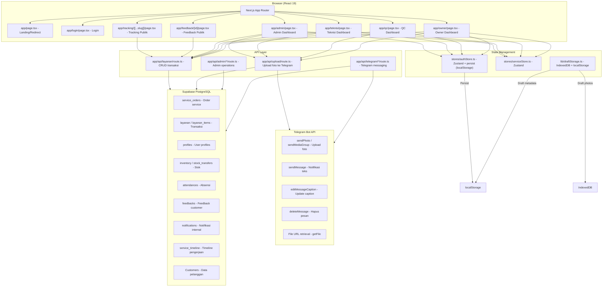
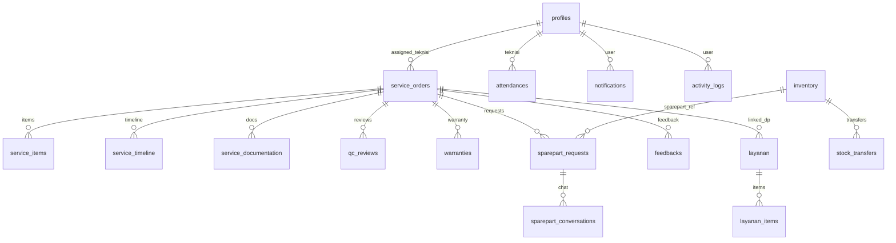
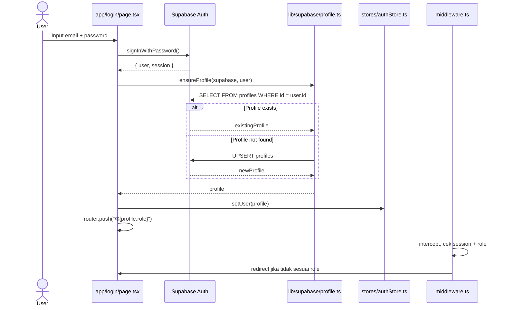
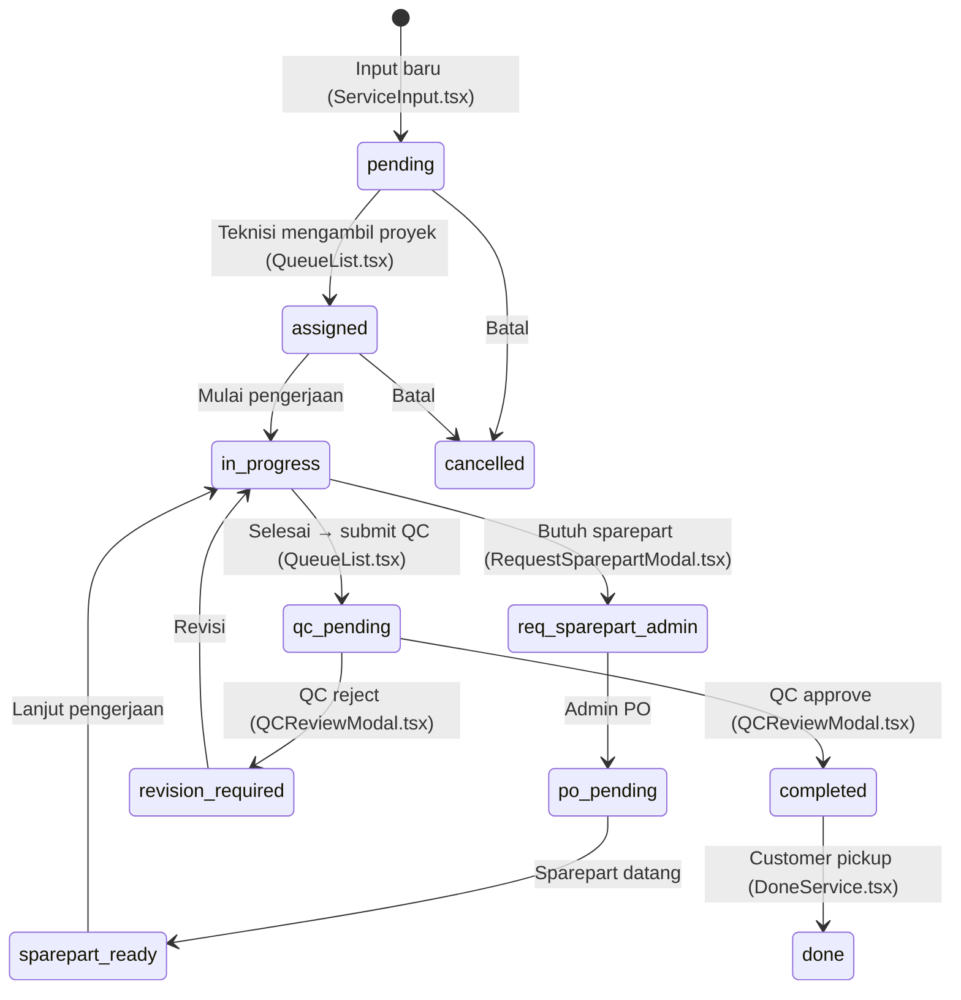
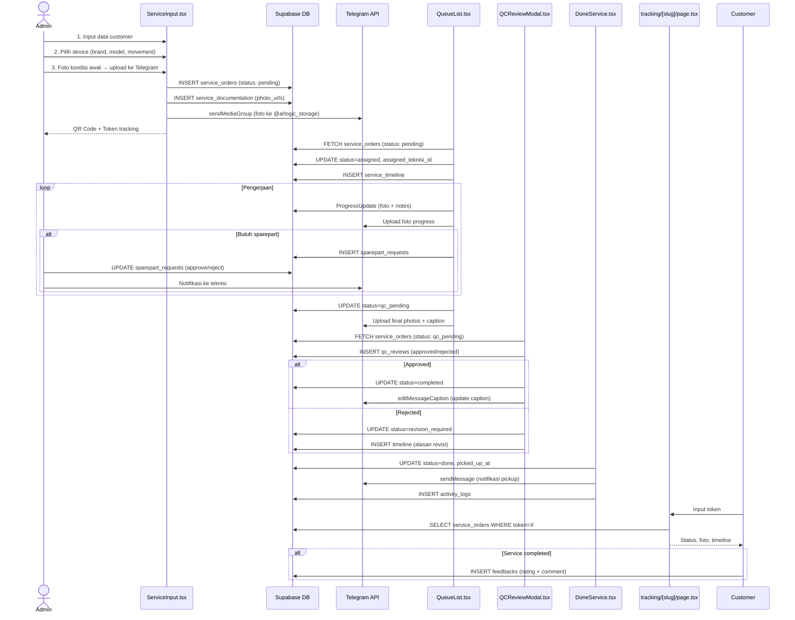
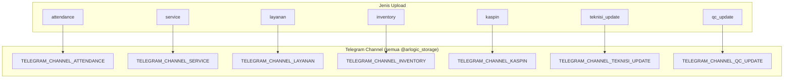
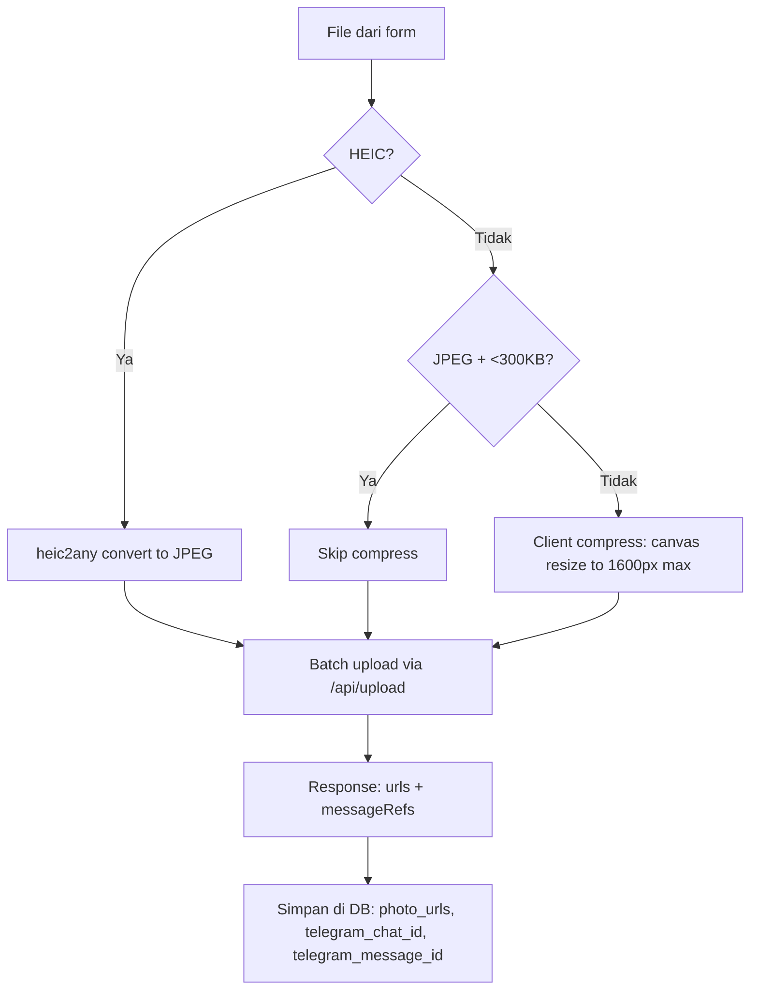

# FLOW DOKUMENTASI — Arlogic Web Services

> **Versi:** Berdasarkan kode aktual per 16 Juli 2026  
> **Stack:** Next.js 16.2 (App Router) + Supabase (PostgreSQL) + Telegram Bot API  
> **Fokus:** 1 cabang/outlet (belum multi-tenant)

---

## 1. PETA ARSITEKTUR SISTEM



---

## 2. SKEMA DATABASE (Tabel Aktif)

### 2.1 Tabel Inti — Service Management

| Tabel | File Referensi | Fungsi |
|-------|---------------|--------|
| `profiles` | `db/supabase-schema.sql:12` | User profile (FK ke auth.users) |
| `service_orders` | `db/supabase-schema.sql:28` | Order service jam tangan |
| `service_items` | `db/supabase-schema.sql:74` | Item jasa/sparepart per order |
| `service_documentation` | `db/supabase-schema.sql:87` | Foto dokumentasi per stage |
| `service_timeline` | `db/supabase-schema.sql:99` | Timeline aktivitas per order |
| `service_jasa` | `db/supabase-schema.sql:341` | Master data jasa |
| `qc_reviews` | `db/supabase-schema.sql:203` | Review QC |
| `warranties` | `db/supabase-schema.sql:255` | Garansi |
| `feedbacks` | `db/supabase-schema.sql:268` | Feedback customer (UNIQUE per service_order_id) |

### 2.2 Tabel Transaksi & Keuangan

| Tabel | File Referensi | Fungsi |
|-------|---------------|--------|
| `layanan` | `db/supabase-schema.sql:319` | Transaksi utama (pendapatan/pengeluaran) |
| `layanan_items` | `db/supabase-schema.sql:282` | Multi-item per transaksi |
| `expenses` | `routes/admin/expenses` | Pengeluaran operasional (CRUD via API) |
| `closings` | `routes/admin/closing` | Closing harian (SQL di route.ts) |

### 2.3 Tabel Inventory & Sparepart

| Tabel | File Referensi | Fungsi |
|-------|---------------|--------|
| `inventory` | `db/supabase-schema.sql:158` | Stok barang (store + warehouse) |
| `stock_transfers` | `db/supabase-schema.sql:178` | Transfer stok antar lokasi |
| `sparepart_requests` | `db/supabase-schema.sql:352` | Request sparepart dari teknisi |
| `sparepart_conversations` | `db/supabase-schema.sql:369` | Chat approve/reject sparepart |
| `categories` | `db/supabase-schema.sql:193` | Kategori inventory |

### 2.4 Tabel Pendukung

| Tabel | File Referensi | Fungsi |
|-------|---------------|--------|
| `attendances` | `db/supabase-schema.sql:113` | Absensi (check-in/out + foto) |
| `customers` | `routes/customer-new` | Data customer (phone UNIQUE) |
| `notifications` | `db/supabase-schema.sql:304` | Notifikasi internal real-time |
| `activity_logs` | `db/supabase-schema.sql:215` | Audit trail |
| `watch_database` | `db/supabase-schema.sql:239` | Database referensi jam tangan |
| `contact_logs` | `db/supabase-schema.sql:226` | Log kontak customer |
| `tracking_logs` | `references di schema` | Log visit halaman tracking |

### 2.5 RLS Policy (Semua tabel — `db/supabase-schema.sql:403`)

**Semua tabel** menggunakan RLS policy tunggal: `public_all_access` — yaitu `auth.uid() IS NOT NULL`. Artinya:
- Semua user yang terautentikasi bisa membaca/menulis semua data
- Tidak ada role-based filtering di level database
- Role enforcement hanya di **level aplikasi** (middleware + API routes + client)

> **Catatan Risiko:** Jika middleware/auth di-bypass, semua data bisa diakses tanpa batasan role.

### 2.6 ERD Relasi



---

## 3. FLOW AUTENTIKASI & OTORISASI

### 3.1 Proses Login



### 3.2 Role & Hak Akses

| Role | Dashboard | Service | Inventory | Transaksi | Absensi | Users | Closing | Owner View |
|------|-----------|---------|-----------|-----------|---------|-------|---------|------------|
| **admin** | `/admin` | ✅ CRUD | ✅ CRUD | ✅ CRUD | ✅ View all | ✅ CRUD | ✅ Buat | ✅ View |
| **teknisi** | `/teknisi` | ✅ Kerjakan | ✅ Request | ❌ | ✅ Diri sendiri | ❌ | ❌ | ❌ |
| **supervisor** | `/qc` | ✅ Review QC | ✅ Request | ✅ Lihat | ✅ View | ❌ | ❌ | ❌ |
| **owner** | `/owner` | ✅ Lihat | ❌ | ✅ Lihat | ✅ View | ✅ Lihat | ✅ Approve | ✅ Full |
| **customer** | Hanya tracking | ❌ | ❌ | ❌ | ❌ | ❌ | ❌ | ❌ |

### 3.3 Session Handling — `components/Providers.tsx`

```mermaid
flowchart TD
    A[Providers mount] --> B{supabase.auth.getUser()}
    B -->|Success + user| C[ensureProfile + setUser]
    B -->|Failed| D[Fallback: getSession()]
    D -->|Session exists| C
    D -->|No session| E[setUser(null)]
    C --> F[setIsLoading(false)]
    E --> F

    G[onAuthStateChange] --> H{event type}
    H -->|SIGNED_IN| C
    H -->|SIGNED_OUT| I[Verify session hilang]
    I --> J[setUser(null) + logout()]
    J --> K[router.push('/login')]
    H -->|TOKEN_REFRESHED| C
```

### 3.4 Auth Proxy — `proxy.ts`

Auth checking via proxy function, di-load di awal request. Memeriksa session Supabase dan melakukan role-based redirect.

```mermaid
flowchart TD
    A[Request masuk] --> B{Static asset?}
    B -->|API / _next / favicon| C[Allow]
    B -->|Halaman| D[supabase.auth.getUser()]
    D -->|Tidak login| E{Public route?}
    E -->|Ya: /login /tracking /feedback| C
    E -->|Tidak| F[Redirect ke /login]
    D -->|Login| G{Role check}
    G -->|/login| H[Redirect ke dashboard sesuai role]
    G -->|Lainnya| I{Sesuai route role?}
    I -->|Ya| C
    I -->|Tidak| J[Redirect ke dashboard role]
```

---

## 4. FLOW INTI — WATCH SERVICE

### 4.1 State Machine Service Order



### 4.2 End-to-End Flow Service



### 4.3 Detail Setiap Stage

#### Stage 1: Intake (`ServiceInput.tsx` — 1425 baris)
- **File:** `components/admin/ServiceInput.tsx`
- **Role:** Admin
- **Input:** Customer name/phone, device info, issue description, kondisi awal (foto)
- **Proses:**
  1. Customer autocomplete (search from `customers` table)
  2. Form 4-step wizard: Customer → Watch → Photos → Issue
  3. Generate `invoice_number` dan `token` unik
  4. Upload foto ke Telegram via `/api/upload`
  5. Buat draft recovery jika form belum selesai
  6. Cek DP transaction dari `layanan` table (via customer phone)
- **Output:** `service_orders` record baru (status: `pending`)

#### Stage 2: Assignment (`QueueList.tsx` — 1113 baris)
- **File:** `components/teknisi/QueueList.tsx`
- **Role:** Teknisi
- **Proses:**
  1. Fetch orders dengan status `pending` (belum diassign)
  2. Teknisi klik "Take Project" → update `assigned_teknisi_id` = teknisi.id
  3. Status berubah ke `assigned`, timeline entry dibuat

#### Stage 3: Pengerjaan (`ServiceTimeline.tsx`, `ProgressUpdate.tsx`)
- **File:** `components/teknisi/ServiceTimeline.tsx` (362 baris)
- **File:** `components/teknisi/ProgressUpdate.tsx` (244 baris)
- **Proses:**
  1. Teknisi update progress dengan template pesan (Diagnosis, Parts Ordered, Progress Photo, Testing, dll)
  2. Upload foto progress ke Telegram
  3. Add/remove jasa & sparepart (via `AddJasaModal.tsx`, `AddSparepartModal.tsx`)
  4. Timeline entries disimpan di `service_timeline` table
  5. Jika butuh sparepart → status `req_sparepart_admin`

#### Stage 4: Request Sparepart (`RequestSparepartModal.tsx`, `SparepartChat.tsx`)
- **File:** `components/teknisi/RequestSparepartModal.tsx` (302 baris)
- **File:** `components/admin/SparepartChat.tsx` (493 baris)
- **Role:** Teknisi → Admin
- **Proses:**
  1. Teknisi request sparepart (pilih dari inventory atau input manual)
  2. Insert ke `sparepart_requests` (status: `pending`)
  3. Admin dapat notifikasi real-time
  4. Admin approve/reject via `SparepartChat.tsx`
  5. Jika approve → status `po_pending` sampai sparepart ready

#### Stage 5: QC (`QCReviewModal.tsx` — 958 baris)
- **File:** `components/qc/QCReviewModal.tsx`
- **Role:** Supervisor (QC)
- **Proses:**
  1. Fetch orders dengan status `qc_pending`
  2. Review foto + item jasa/sparepart + harga
  3. Approve → status `completed`, edit caption Telegram
  4. Reject → status `revision_required`, catat alasan

#### Stage 6: Pickup (`DoneService.tsx` — 162 baris)
- **File:** `components/admin/DoneService.tsx`
- **Role:** Admin
- **Proses:**
  1. Tampilkan services dengan status `completed` (belum pickup)
  2. Admin klik "Sudah Diambil" → `POST /api/admin/service-pickup`
  3. Update `picked_up_at`, status `done`
  4. Kirim notifikasi Telegram
  5. Buat activity log

#### Stage 7: Tracking Publik (`tracking/[[...slug]]/page.tsx` — 626 baris)
- **File:** `app/tracking/[[...slug]]/page.tsx`
- **Role:** Customer (tanpa login)
- **Fitur:**
  1. Input token → lookup `service_orders`
  2. Progress steps (pending → assigned → in_progress → ... → completed)
  3. Detail info (customer, device, issue)
  4. Foto kondisi awal
  5. Rincian biaya (jasa + sparepart)
  6. Timeline updates
  7. Link ke feedback (`/feedback/[id]?token=...`)

---

## 5. INTEGRASI TELEGRAM SEBAGAI FILE STORAGE

### 5.1 Arsitektur Upload

```mermaid
flowchart LR
    A[Client Component] -->|File + type + caption| B["/api/upload (route.ts)"]
    B --> C{sharp available?}
    C -->|Yes| D[sharp.jpeg quality 90%]
    C -->|No| E[Skip compress]
    D --> F[uploadMultipleToTelegram]
    E --> F
    F --> G{Chunk >= 2?}
    G -->|Yes| H[sendMediaGroup]
    G -->|No| I[sendPhoto individual]
    H -->|Fallback| I
    I --> J["sendPhotoBlob"]
    J --> K[Telegram API]
    K --> L["getFile → file URL"]
    L --> M[Return: url + chat_id + message_id]
    M --> N[Client simpan di DB]
```



### 5.2 Channel Mapping



### 5.3 Edit Caption Flow

```mermaid
sequenceDiagram
    participant QC as QCReviewModal.tsx
    participant API as /api/telegram/edit-caption
    participant Supabase
    participant Telegram

    QC->>Supabase: UPDATE service_orders status=completed
    QC->>API: POST { service_order_id, new_caption }
    API->>Supabase: SELECT service_documentation WHERE service_order_id=X
    Supabase-->>API: [docs with telegram_chat_id, telegram_message_id]
    loop For each doc (QC → progress → initial)
        API->>Telegram: editMessageCaption(chat_id, message_id, caption)
        alt Success
            Telegram-->>API: { ok: true }
            API-->>QC: { success: true }
            break
        else Failed
            Telegram-->>API: { ok: false, description }
            API->>API: Try next doc
        end
    end
    alt All failed
        API-->>QC: { error: "Failed to edit caption" }
    end
```

### 5.4 Client-Side Upload Pipeline — `hooks/useUpload.ts`



### 5.5 Error Handling Telegram

| Skenario | Handling | File |
|----------|----------|------|
| sendMediaGroup gagal | Fallback ke sendPhoto individual per file | `lib/telegram.ts:219-223` |
| sendSinglePhoto gagal | Log error, return null (skip foto) | `lib/telegram.ts:86-91` |
| getFileUrl gagal | Fallback ke sendPhoto individual | `lib/telegram.ts:196-203` |
| Telegram non-JSON response | Throw Error detail | `lib/telegram.ts:44-53` |
| Bot token tidak dikonfigurasi | Throw Error | `lib/telegram.ts:144` |
| Channel ID tidak ditemukan | Throw Error | `lib/telegram.ts:145-146` |

> **Gap:** Tidak ada retry mechanism, monitoring, atau queue. Jika Telegram down, foto hilang.

---

## 6. DASHBOARD & REPORTING

### 6.1 Admin Dashboard — `app/admin/page.tsx` (1462 baris)

| Widget | Data Source | File |
|--------|-------------|------|
| Stat Cards (users, services, revenue, etc) | `profiles`, `service_orders`, `layanan`, `inventory` | Inline `fetchStats()` |
| Today Stats (transactions, revenue, expenses) | `layanan` (filter created_at hari ini) | Inline `fetchTodayStats()` |
| Recent Services (table) | `service_orders` (LIMIT 10) | Inline `fetchRecentServices()` |
| Recent Transactions (table) | `layanan` (filter hari ini, LIMIT 15) | Inline `fetchRecentTransactions()` |
| Notifications | `notifications` (filter user_id) | Inline `fetchNotifications()` |
| Inventory List | `inventory` | Inline `fetchInventory()` |
| Attendance Status | `attendances` (filter hari ini + user_id) | Inline `checkTodayAttendance()` |
| Chart (6-month trend) | `layanan` + `service_orders` aggregated | Inline `generateChartData()` |
| Dashboard Charts | Recharts (bar + pie) | `DashboardCharts.tsx` |
| Analytics Area Chart | Recharts area chart | `AdminDashboardAnalytics.tsx` |
| Attendance Dashboard | Full attendance table | `AttendanceDashboard.tsx` |
| Transaction Management | Full CRUD | `TransactionManagement.tsx` |
| Service List | Table with filters | `ServiceList.tsx` |
| Customer List | Full CRUD with import | `CustomerList.tsx` |
| Inventory Management | Full CRUD with photo | `InventoryManagement.tsx` |
| Role Management | CRUD users | `RoleManagement.tsx` |
| Closing Dashboard | Daily closing | `ClosingDashboard.tsx` |
| Done Service | Pickup management | `DoneService.tsx` |

### 6.2 Owner Dashboard — `app/owner/page.tsx` (935 baris)

| Widget | Data Source | File |
|--------|-------------|------|
| Revenue Chart | `layanan` + `expenses` | `RevenueChart.tsx` |
| Performance Chart | `service_orders` + `profiles` | `PerformanceChart.tsx` |
| Feedback List | `feedbacks` + star rating | `FeedbackList.tsx` |
| Closing Approval | `closings` | `ClosingApproval.tsx` |
| Watch Database | `watch_database` | `WatchDatabase.tsx` |
| Tracking Visits | `tracking_logs` | `TrackingVisits.tsx` |
| Export Button | All data | `ExportButton.tsx` |

### 6.3 Teknisi Dashboard — `app/teknisi/page.tsx` (1321 baris)

| Widget | Data Source | File |
|--------|-------------|------|
| Queue (pending services) | `service_orders` (status: pending) | `QueueList.tsx` |
| My Projects (assigned) | `service_orders` (assigned_teknisi_id) | `QueueList.tsx` |
| Service Timeline | `service_timeline` (realtime subscription) | `ServiceTimeline.tsx` |
| Attendance | `attendances` | `AttendanceDashboard.tsx` |
| Performance Stats | `service_orders` + `feedbacks` | Inline |
| Kaspin Update | `service_orders` + Telegram | `KaspinUpdate.tsx` |

### 6.4 QC Dashboard — `app/qc/page.tsx` (470 baris)

| Widget | Data Source | File |
|--------|-------------|------|
| QC Pending List | `service_orders` (status: qc_pending) | `QCServiceList.tsx` |
| Review Modal | `service_orders` + `service_items` + `service_documentation` | `QCReviewModal.tsx` |
| Attendance Report | `attendances` | `AttendanceReport.tsx` |
| Stats Cards | `service_orders` aggregate | `QCStats.tsx` |

---

## 7. SEMUA API ENDPOINT

### 7.1 API Routes

| Method | Path | Input | Output | Dipakai di | Role |
|--------|------|-------|--------|------------|------|
| GET | `/api/layanan` | — | `{ data: Layanan[] }` | Admin/Teknisi/QC pages | Semua auth |
| POST | `/api/layanan` | `{ customer_name, jenis_layanan, ... }` | `{ success, data }` | LayananForm.tsx | Semua auth |
| PUT | `/api/layanan` | `{ id, ...updateData }` | `{ success, data }` | LayananList.tsx | Creator/Admin |
| POST | `/api/upload` | multipart: files + type + caption | `{ urls, messages }` | ServiceInput, LayananForm, AttendanceModal, dll | Semua auth |
| POST | `/api/admin/closing` | `{ action: 'create'|'approve'|'list', ... }` | `{ success, data }` | ClosingDashboard.tsx | Admin |
| GET | `/api/admin/closing` | — | `{ sql: CREATE_TABLE_SQL }` | — | — |
| POST | `/api/admin/create-user` | `{ email, password, full_name, role, gender }` | `{ success, user }` | RoleManagement.tsx | Admin |
| POST | `/api/admin/delete-user` | `{ userId }` | `{ success }` | RoleManagement.tsx | Admin |
| POST | `/api/admin/expenses` | `{ item_name, amount, ... }` | `{ success, data }` | PengeluaranForm.tsx | Admin |
| GET | `/api/admin/expenses` | `?start_date=&end_date=&payment_method=` | `{ data, summary, pagination }` | LayananList.tsx | Admin |
| PUT | `/api/admin/expenses` | `{ id, item_name, ... }` | `{ success, data }` | LayananList.tsx | Admin |
| DELETE | `/api/admin/expenses` | `?id=` | `{ success }` | LayananList.tsx | Admin |
| POST | `/api/admin/service-pickup` | `{ serviceOrderId }` | `{ success, data }` | DoneService.tsx | Admin |
| GET | `/api/admin/service-pickup` | `?serviceOrderId=` | `{ data, is_picked_up }` | DoneService.tsx | Admin |
| POST | `/api/telegram` | `{ type, message, channel }` | `{ success, chat_id, message_id }` | SparepartChat.tsx, dll | Semua auth |
| POST | `/api/telegram/customer-new` | `{ name, phone }` | `{ status, name }` | ServiceInput.tsx | Semua auth |
| POST | `/api/telegram/delete-message` | `{ chat_id, message_id }` | `{ success }` | Internal | Server |
| POST | `/api/telegram/edit-caption` | `{ service_order_id, new_caption }` | `{ success }` | QCReviewModal.tsx | Supervisor |
| POST | `/api/telegram/edit-message` | `{ chat_id, message_id, text, is_caption }` | `{ success }` | Closing, dll | Admin |
| GET | `/api/test-r2` | — | `{ success, buckets }` | Testing | — |

### 7.2 Middleware (`middleware.ts`)

Proteksi route berdasarkan role:
- `/admin` → hanya role `admin`
- `/teknisi` → hanya role `teknisi`
- `/qc` → hanya role `supervisor`
- `/owner` → hanya role `owner`
- `/login`, `/tracking`, `/feedback` → public

### 7.3 Client-Side Service Layer

Selain API routes, banyak komponen **langsung akses Supabase client** (`lib/supabase/client.ts`) untuk:
- Real-time subscriptions (Postgres Changes)
- Fetch data tanpa perlu API route (QUERY langsung dari browser)
- Insert/update records langsung

**Contoh direct Supabase access:**
| Komponen | Query | Tujuan |
|----------|-------|--------|
| `Components/Providers.tsx` | `getUser()`, `getSession()` | Initial auth |
| `admin/page.tsx` | `fetchStats()`, `fetchRecentServices()`, dll | Dashboard data |
| `QueueList.tsx` | `SELECT service_orders`, realtime subscribe | Queue assignments |
| `ServiceTimeline.tsx` | `INSERT service_timeline`, realtime subscribe | Timeline updates |

---

## 8. STRUKTUR YANG DISIAPKAN UNTUK MASA DEPAN

### 8.1 Multi-Item Transaksi (`layanan_items`)
- **Tabel:** `layanan_items` (FK ke `layanan`)
- **Status:** ✅ Aktif digunakan oleh `LayananForm.tsx` untuk multi-item per transaksi
- **Catatan:** Ini bukan "masa depan", sudah aktif dipakai

### 8.2 Multi-Cabang / Outlet
- **Tidak ada kolom `outlet_id` atau `branch_id`** di tabel manapun
- **Tidak ada tabel `outlets` atau `businesses`**
- **Kesimpulan:** Tidak ada persiapan multi-tenant. Semua data flat untuk 1 cabang.

### 8.3 Kolom Tambahan di `customers`
- `profesi`, `email`, `alamat`, `point` — sudah ditambahkan via migration
- **Status:** Kolom sudah ada di schema tapi belum semua diisi/digunakan di form

### 8.4 Field `linked_service_order_id` di `layanan`
- **Tujuan:** Menandai DP transaction yang terhubung ke service order
- **Status:** Kolom sudah ada, digunakan oleh `ServiceInput.tsx` untuk mengambil DP dari customer yang sama

### 8.5 Stock Transfer (`stock_transfers`)
- **Tujuan:** Transfer stok antara `store` dan `warehouse`
- **Status:** ✅ Aktif digunakan di `InventoryManagement.tsx`

### 8.6 R2 (Cloudflare) Integration
- **File:** `lib/cloudflare-r2.ts`, `app/api/test-r2/route.ts`
- **Status:** ❌ **BELUM AKTIF** — R2 client dibuat, endpoint test ada, tapi tidak ada flow upload/read yang benar-benar menggunakan R2. Semua file storage masih via Telegram.

---

## 9. GAP & REKOMENDASI

### 9.1 Critical Gaps

| Gap | Detail | Dampak | Rekomendasi |
|-----|--------|--------|-------------|
| **RLS policy terlalu longgar** | Semua tabel pakai `auth.uid() IS NOT NULL` — semua user bisa akses semua data | Tidak ada isolasi data per role | Implementasi role-based RLS policies |
| **Storage hanya di Telegram** | Semua foto disimpan di Telegram, tidak ada backup | Jika Telegram down, foto hilang. Rate limit ketat (20MB/file, chunk 10) | Implementasi R2/S3 sebagai primary storage |
| **Tidak ada retry mechanism** | Upload/Telegram API call tidak ada retry | Kegagalan network transient menyebabkan data loss | Wrapper retry dengan exponential backoff |
| **Tidak ada audit log lengkap** | `activity_logs` hanya diisi di beberapa tempat | Tidak ada trail perubahan yang komprehensif | Standardisasi logging di semua operasi CRUD |
| **Error logging via console** | Semua error menggunakan `console.error` | Tidak ada monitoring/alerting | Implementasi logging service (Sentry, etc.) |
| **Cache strategy** | Tidak ada caching | Setiap render fetch ulang data | Implementasi SWR/React Query + server-side caching |

### 9.2 Performance Bottlenecks (Scale ke Multi-Cabang)

| Issue | Lokasi | Saat Ini | Saat Skala |
|-------|--------|----------|------------|
| **No pagination** | Semua list views | Fetch semua records | Akan crash browser untuk ribuan records |
| **Supabase direct queries** | Banyak komponen | Client langsung query | No centralized caching, duplikasi koneksi |
| **All `use client`** | Semua halaman | Full JS bundle | Slow initial load |
| **Real-time subscriptions** | ~10 komponen | Subscribe ke postgres_changes | Koneksi DB membengkak |
| **LocalStorage heavy** | Draft system | Base64 photos di localStorage | Cepat overflow 5MB |
| **Monolith components** | 12+ file > 500 baris | Sulit di-maintain | Semakin kritis saat feature bertambah |

### 9.3 Security Gaps (Telah Diperbaiki)

| Issue | Status | Perbaikan |
|-------|--------|-----------|
| ❌ Tidak ada middleware auth | ✅ **DIPERBAIKI** | `middleware.ts` dibuat dari `proxy.ts` |
| ❌ Secret di `.env` terekspos | ✅ **DIPERBAIKI** | `.env.example` dibuat |
| ❌ No CSRF protection | ✅ **DIPERBAIKI** | `lib/csrf.ts` + diaktifkan di route kritis |
| ❌ No rate limiting | ✅ **DIPERBAIKI** | `lib/rate-limit.ts` + diaktifkan di route kritis |
| ❌ `getSession()` vs `getUser()` inconsistency | ✅ **DIPERBAIKI** | Standardisasi ke `getUser()` di semua API routes |

### 9.4 Remaining Improvements

| Issue | Detail | Priority |
|-------|--------|----------|
| **All `use client`** | Zero server components | Medium |
| **Monolith files** | 12 file > 500 lines (partial fix: admin sidebar extracted, upload system optimized) | Medium |
| **213 `any` types** | TypeScript safety rendah | Medium |
| **Hanya 4 test files** | Coverage sangat rendah | Low |
| **60 `!important` CSS** | Dark mode CSS architecture | Low |
| **No CI/CD** | Tidak ada GitHub Actions | Low |

---

## 10. REFERENSI FILE

### Root Config
| File | Fungsi |
|------|--------|
| `proxy.ts` | ✅ Auth proxy (session + role-based redirect) |
| `middleware.ts` | ❌ Tidak dipakai (middleware deprecated di Next.js 16) |
| `next.config.ts` | Next.js config (images, serverExternalPackages) |
| `.env` | Environment variables (gitignored) |
| `.env.example` | ✅ Template env vars (NEW) |
| `eslint.config.mjs` | ESLint flat config |

### Library
| File | Fungsi |
|------|--------|
| `lib/telegram.ts` | ✅ Telegram API wrapper (upload, edit, send) |
| `lib/supabase/client.ts` | ✅ Browser Supabase client |
| `lib/supabase/server.ts` | ✅ Server Supabase client (cookies) |
| `lib/supabase/profile.ts` | ✅ Profile ensure/fallback |
| `lib/draftStorage.ts` | ✅ Draft system (localStorage + IndexedDB) |
| `lib/csrf.ts` | ✅ CSRF origin validation (NEW) |
| `lib/rate-limit.ts` | ✅ In-memory rate limiting (NEW) |
| `lib/cloudflare-r2.ts` | ❌ R2 client (tidak dipakai) |

### Stores
| File | Fungsi |
|------|--------|
| `stores/authStore.ts` | Zustand persisted auth state |
| `stores/serviceStore.ts` | Zustand service order state |

### Database
| File | Fungsi |
|------|--------|
| `db/supabase-schema.sql` | Full schema (889 baris) |
| `db/layanan.sql` | Layanan table schema |
| `db/migration-*.sql` | 7 migration files |

---

*Dokumen ini dibuat berdasarkan kode aktual per 16 Juli 2026. Diagram Mermaid dapat dirender di GitHub atau editor yang mendukung.*
