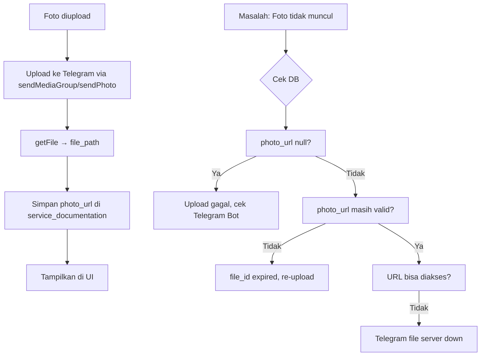

# ARLOGIC WEB SERVICES — ARSIP REVISI

> Kumpulan seluruh catatan revisi, debug guide, migration instructions, dan progres pengembangan.
> File asli: lihat folder `readme/arsip/`.

---

## DAFTAR ISI

1. [Fitur Aplikasi](#1-fitur-aplikasi)
2. [Database Schema](#2-database-schema)
3. [Ringkasan Revisi](#3-ringkasan-revisi)
   - [v.25 — 2026-07-15](#v25--2026-07-15)
   - [v.30 — 2026-07-11](#v30--2026-07-11)
   - [v.31 — 2026-07-11](#v31--2026-07-11)
   - [v.32 — 2026-07-11](#v32--2026-07-11)
   - [v.33 — 2026-07-11](#v33--2026-07-11)
   - [V3 — 2026-07-06](#v3--2026-07-06)
4. [Debug Guide](#4-debug-guide)
5. [Migration Instructions](#5-migration-instructions)
6. [Progres](#6-progres)

---

## 1. FITUR APLIKASI

*Sumber: `fitur.md`*

### Authentication & Role Management
- Login/logout dengan Supabase Auth
- Role-based access: admin, teknisi, supervisor/owner, customer
- Profile auto-creation via trigger `on_auth_user_created`
- Redirect otomatis sesuai role

### Service Order (Watch Repair)
- Admin input service order dengan foto, brand, model, keluhan
- Generate QR code & token tracking untuk customer
- Tracking page publik (`/tracking/[[...slug]]`)
- Status: pending → assigned → in_progress → waiting_sparepart → qc_pending → completed
- Timeline update & service items (sparepart + jasa)
- Notifikasi Telegram per status

### Transaction (Layanan)
- Input transaksi layanan (service_langsung, order_online, beli jam, dll)
- Filter by jenis layanan, status, metode pembayaran, tanggal
- Export to CSV
- Multiple photo upload support

### Attendance
- Check-in & check-out dengan upload foto
- Popup enforcement sebelum jam 11:00
- Timer dashboard realtime
- Perhitungan lembur otomatis
- Telegram template: ABSEN MASUK / ABSEN PULANG

### Inventory / Stock Management
- CRUD sparepart/inventory
- Kategori management
- Stock toko & stok gudang
- Transfer stock antara gudang dan toko

### QC / Supervisor
- Dashboard QC dengan list service selesai teknisi
- Approve/reject dengan catatan
- Edit caption Telegram otomatis saat QC revisi item
- Laporan absensi semua staff

### Owner Dashboard
- Statistik attendance, service, inventory
- Export reports (Excel, PDF)
- Feedback list, tracking visits, closing approval
- Watch database management

### Telegram Integration
- Storage foto via Telegram Bot API
- Upload multiple photos (media group)
- Edit caption otomatis saat QC merevisi item
- Notifikasi customer baru, kaspin update

---

## 2. DATABASE SCHEMA

*Sumber: `schema.md`*

### Core Tables

**profiles** — User profile (FK ke auth.users)
- `id` UUID PK, `email` TEXT, `full_name` TEXT, `role` TEXT
- Role: admin, teknisi, supervisor, owner, customer

**service_orders** — Order service jam
- `id` UUID PK, `invoice_number` TEXT UNIQUE, `token` TEXT UNIQUE
- `customer_name`, `customer_phone`, `device_type`, `device_brand`
- `watch_brand`, `watch_model`, `watch_movement`, `watch_condition`
- `issue_description`, `status`, `assigned_teknisi_id`
- Status: pending, assigned, in_progress, req_sparepart_admin, po_pending, sparepart_ready, qc_pending, revision_required, completed, done, cancelled

**service_items** — Item jasa/sparepart per order
- `service_order_id` FK, `item_type` (jasa/sparepart), `name`, `quantity`, `price`

**service_documentation** — Foto dokumentasi per stage
- `service_order_id` FK, `photo_url`, `stage`, `uploaded_by`

**service_timeline** — Timeline aktivitas per order
- `service_order_id` FK, `teknisi_id`, `status`, `message`, `photo_url`, `details` JSONB

**layanan** — Transaksi utama (pendapatan/pengeluaran)
- `customer_name`, `customer_whatsapp`, `jenis_layanan`, `handled_by`
- `metode_pembayaran`, `lead_source`, `nominal`, `photo_urls`
- `linked_service_order_id` (untuk DP yang terhubung ke service order)

**inventory** — Stok barang
- `item_name`, `sku` UNIQUE, `store_stock`, `warehouse_stock`, `unit`, `min_stock`
- `category`, `price`, `photo_url`

**attendances** — Absensi
- `teknisi_id` FK, `photo_url`, `check_in`, `check_out`, `status`
- `work_duration`, `total_minutes`, `overtime_minutes`, `is_overtime`

**feedbacks** — Feedback customer
- `service_order_id` FK (UNIQUE), `customer_name`, `rating` (1-5), `comment`

**notifications** — Notifikasi internal
- `user_id` FK, `title`, `message`, `type`, `is_read`, `link`

**customers** — Data pelanggan
- `name`, `phone` (UNIQUE), `last_transaction`, `point`, `profesi`, `email`, `alamat`

### RLS Policy
Semua tabel menggunakan RLS policy `public_all_access` — yaitu `auth.uid() IS NOT NULL`.
Role enforcement dilakukan di level aplikasi (middleware + API routes + client).

---

## 3. RINGKASAN REVISI

### v.25 — 2026-07-15

**Issue 1: Add New Service Error "No URLs returned from server"**
- Root cause: `sendMediaGroup` gagal untuk 1 foto (Telegram min 2 items)
- Fix: skip sendMediaGroup jika < 2 foto, fallback per-photo jika getFileUrl gagal
- Files: `lib/telegram.ts`, `hooks/useUpload.ts`

**Issue 2: MECHANICAL → DIGITAL**
- Opsi tipe jam "MECHANICAL" diganti "DIGITAL"
- Files: `types/index.ts`, `ServiceInput.tsx`, `ServiceList.tsx`, `WatchDatabase.tsx`, tracking page

**Issue 3: Metode Pembayaran EDC Mandiri & EDC BCA di DP**
- Files: `components/admin/ServiceInput.tsx`

**Issue 4: Down Payment Tidak Muncul di Detail Service**
- Files: `ServiceList.tsx`, `ServiceDetailModal.tsx`, `FeedbackList.tsx`

**Issue 5: Multi Jenis Layanan — Kirim Telegram Terpisah + List Per-Item**
- Files: `LayananForm.tsx`, `TransactionManagement.tsx`

### v.30 — 2026-07-11

**Summary:**
- Polishing & perbaikan besar untuk owner dashboard
- Fix telegram caption + error handling upload foto
- Perbaikan multi-item transaksi
- Fix closing module

**Main changes:**
- Owner dashboard: Closing approval, tracking visits, feedback list
- Telegram: Edit caption saat QC + error handling upload
- Transaksi: Multi-item, filter, export
- Service: DP display, QR code fix
- Theme: Dark mode refinement

### v.31 — 2026-07-11

**Issue: Telegram Photos Not Showing in Service Detail/Timeline**

Root cause:
1. `service_documentation` menyimpan `chat_id` dari channel, bukan dari message
2. `getFileUrl()` gagal karena Telegram file_id expired setelah beberapa jam
3. `photo_url` menyimpan URL yang langsung dari API response `file_path` yang ternyata temporary

Fix:
- Simpan `file_path` (path permanen) + `chat_id` + `message_id` di `service_documentation`
- Gunakan endpoint `getFile` dengan `file_id` yang benar
- Hapus caching async di `getFileUrl` yang menyebabkan stale reference
- Di `ServiceList.tsx`, gunakan `photo_url` langsung dari DB (tanpa re-fetch dari Telegram)

### v.32 — 2026-07-11

**Issue: Telegram Photo Deleted After QC Edit + Sparepart/Service Price Update Tidak Masuk ke Timeline**

Fix:
1. **Sparepart/jasa price update tidak masuk ke timeline**: 
   - `AddSparepartModal.tsx`: Add required fields: `price`, `total`, `sku`
   - `QueueList.tsx`: Save sparepart details (price, qty, total, sku) ke timeline saat submit QC
   
2. **Foto Telegram terhapus setelah QC edit**:
   - `editMessageCaption` hanya edit caption, tidak perlu re-upload foto
   - Problem: caption di-generate ulang tanpa include semua item yang sudah ditambah
   - Fix: Generate caption berdasarkan `localItems` current state (bukan dari DB snapshot)

3. **Update total cost saat QC edit**:
   - `QCReviewModal.tsx`: Recalculate total cost, selisih, return amount

### v.33 — 2026-07-11

**Issue 1: Sparepart Sync (Timeline → QC → Telegram)**
- Timeline sparepart hanya disimpan di `service_timeline.details.spareparts`, tidak di `service_items`
- Fix: Insert sparepart ke `service_items` saat submit timeline; merge sparepart di QCReviewModal

**Issue 2: Edit/Remove Sparepart di Timeline Form**
- Add `editSparepart()`, `updateSparepart()` functions
- Files: `ServiceTimeline.tsx`

**Issue 3: Telegram Caption Sync (QCReviewModal)**
- Calculate `totalCostWithTimeline` = `totalCost` + `timelineSparePartCost`
- Caption include all spareparts dari service_items + timeline

### V3 — 2026-07-06

**Major Migration (Revisi Batch 9):**
- DP optional untuk service order
- `handled_by` default ke user yang login
- `service_type` → `jenis_layanan` column rename
- Multiple photo support (`photo_urls` array)
- Theme implementation (light/dark mode)
- Owner analytics dashboard
- Migration: `db/supabase-schema.sql` + `db/layanan.sql`

---

## 4. DEBUG GUIDE

*Sumber: `DEBUG-GUIDE-v31.md`*

### Debug Flow Foto Telegram



### Common Issues

1. **Foto tidak muncul di timeline**: Cek `service_documentation.photo_url` — jika null, upload gagal
2. **File ID expired**: Telegram file_id hanya valid ~1 jam untuk `getFile`. Simpan `file_path` langsung
3. **sendMediaGroup gagal**: Coba dengan sendPhoto individual (auto fallback)
4. **Caption tidak update**: `editMessageCaption` membutuhkan `chat_id` + `message_id` yang valid

---

## 5. MIGRATION INSTRUCTIONS

*Sumber: `MIGRATION_INSTRUCTIONS.md`, `REVISI_V3_MIGRATION.md`*

### Menambahkan Kolom Baru

```sql
ALTER TABLE nama_tabel ADD COLUMN IF NOT EXISTS nama_kolom TIPE_DATA DEFAULT nilai;
NOTIFY pgrst, 'reload schema';
```

### Migration Log

| Tanggal | Migration | SQL File |
|---------|-----------|----------|
| 2026-07-15 | GRANT layanan_items | `db/migration-layanan-items-cashdraw.sql` |
| 2026-07-15 | linked_service_order_id di layanan | Manual |
| 2026-07-15 | Add done status (pickup) | `db/migration-add-done-status.sql` |
| 2026-07-15 | Customer fields: profesi, email, alamat | `db/migration-add-customer-fields.sql` |
| 2026-07-15 | Customer phone UNIQUE | `db/migration-add-customer-phone-unique.sql` |
| 2026-07-15 | Customer point column | `db/migration-add-customer-point.sql` |
| 2026-07-15 | Token UNIQUE constraint | `db/migration-add-token-unique.sql` |

### Cara Setup Database Baru

1. Buka Supabase SQL Editor
2. Jalankan `db/supabase-schema.sql` (full schema)
3. Jalankan `db/layanan.sql` (layanan table dengan backward compat)
4. Jalankan semua `db/migration-*.sql` secara berurutan
5. Enable Realtime di Supabase Dashboard untuk tabel: `service_orders`, `layanan`, `notifications`, `service_timeline`

---

## 6. PROGRES

*Sumber: `progres.md`, `progres.txt`*

### Status Per 15 Juli 2026

- ✅ Service order management (CRUD + timeline)
- ✅ Transaksi (multi-item, filter, export)
- ✅ Inventory management (stock + transfer)
- ✅ Attendance (check-in/out + lembur)
- ✅ QC review (approve/reject + edit harga)
- ✅ Owner dashboard (analytics, feedback, closing)
- ✅ Telegram storage integration
- ✅ Customer tracking portal
- ✅ Dark mode theme
- ✅ Export reports (Excel, PDF)

### Dalam Pengembangan

- Multi-cabang support (belum dimulai)
- WhatsApp template automation
- Advanced analytics dashboard
- Mobile app

---

*Dokumen ini digenerate otomatis dari file-file di `readme/arsip/`. Update terakhir: 16 Juli 2026.*
